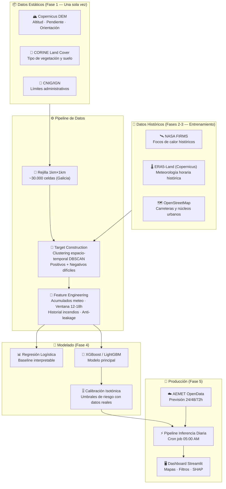

# 🔥 Sistema Predictivo de Anticipación de Incendios Forestales


> **TFM** — Sistema de alerta temprana que estima el riesgo de incendio forestal por zona geográfica a partir de datos meteorológicos, satelitales, geoespaciales y ambientales. El objetivo es anticipar qué zonas presentan mayor probabilidad de incendio en las próximas **24 / 72 horas**.

---

## 📋 Tabla de Contenidos

- [Objetivo del Proyecto](#objetivo-del-proyecto)
- [Arquitectura del Sistema](#arquitectura-del-sistema)
- [Estructura del Repositorio](#estructura-del-repositorio)
- [MVP: Galicia como Región Piloto](#mvp-galicia-como-región-piloto)
- [Fuentes de Datos](#fuentes-de-datos)
- [Stack Tecnológico](#stack-tecnológico)
- [Instalación y Configuración](#instalación-y-configuración)
- [Fases del Proyecto](#fases-del-proyecto)
- [Metodología](#metodología)
- [Convenciones y Guía de Contribución](#convenciones-y-guía-de-contribución)
- [Roadmap](#roadmap)
- [Equipo](#equipo)

---

## 🎯 Objetivo del Proyecto

Construir un sistema **actualizable diariamente** que, para cada celda de 1 km × 1 km del territorio de Galicia, genere:

- Una **probabilidad estimada de incendio** para las próximas 24/72 horas.
- Un **nivel de riesgo calibrado**: Bajo · Moderado · Alto · Extremo.
- Un **mapa interactivo de riesgo** y un **ranking de zonas más vulnerables**.
- Una **explicación de las variables** que justifican cada predicción (interpretabilidad via SHAP).

La aplicación práctica es clara: apoyar la prevención, priorizar recursos, anticipar zonas críticas y facilitar la toma de decisiones en gestión forestal y protección civil.

---

## 🏗️ Arquitectura del Sistema



---

## 📁 Estructura del Repositorio

```
Sistema-deteccion-incendios/
│
├── 📂 src/                          # Código fuente principal (paquete modular)
│   ├── __init__.py
│   ├── 📂 geospatial/               # Fase 1: Rejilla, DEM, CORINE
│   │   ├── __init__.py
│   │   └── README.md
│   ├── 📂 ingestion/                # Fase 2: NASA FIRMS, ERA5-Land, target
│   │   ├── __init__.py
│   │   └── README.md
│   ├── 📂 features/                 # Fase 3: Feature engineering, anti-leakage
│   │   ├── __init__.py
│   │   └── README.md
│   ├── 📂 models/                   # Fase 4: Entrenamiento y calibración
│   │   ├── __init__.py
│   │   └── README.md
│   └── 📂 webapp/                   # Fase 5: Dashboard Streamlit
│       ├── __init__.py
│       └── README.md
│
├── 📂 data/                         # ⚠️ NO incluir en git (ver .gitignore)
│   ├── raw/                         # Datos descargados sin procesar
│   ├── processed/                   # Datos transformados y limpios
│   └── models/                      # Modelos serializados (.pkl, .json)
│
├── 📂 notebooks/                    # Exploración, EDA y prototipado
├── 📂 tests/                        # Tests unitarios e integración
├── 📂 docs/                         # Documentación adicional y memoria TFM
├── 📂 configs/                      # Configuración de hiperparámetros y pipelines
│
├── 📂 knowledge/                    # Documentación del alcance del proyecto
│   ├── Project Plan - Predicción incendios forestales.md
│   ├── fases_proyecto_plan_ataque.md
│   └── justificacion_mvp_comunidad_autonoma.md
│
├── 📂 .agents/skills/               # Skills de Gemini para el proyecto
│   ├── project-conventions/
│   ├── geospatial-processing/
│   ├── data-ingestion/
│   ├── feature-engineering/
│   ├── model-training/
│   └── webapp-dashboard/
│
├── .gitignore
├── .env.example                     # Template de variables de entorno
├── environment.yml                  # Entorno Conda reproducible
└── README.md
```

> **Nota sobre los datos:** Los archivos de datos (NetCDF, Parquet, Shapefiles, modelos .pkl) **no se suben al repositorio** por su tamaño. Ver la sección [Fuentes de Datos](#fuentes-de-datos) para saber cómo descargarlos.

---

## 🗺️ MVP: Galicia como Región Piloto

El MVP se centra en **Galicia** por tres razones:

| Criterio | Detalle |
|---|---|
| **Alta densidad de incendios** | Galicia concentra el mayor número de incendios forestales de España, garantizando suficientes casos positivos para el entrenamiento |
| **Manejabilidad computacional** | ~30.000 celdas de 1km² frente a ~500.000 celdas en toda España (reducción del 94%) |
| **Ecosistema específico** | Minifundio forestal, clima oceánico y alta proporción de eucalipto/pino: dinámicas de incendio diferenciadas y bien documentadas |

Una vez validado el modelo en Galicia (AUC-ROC > 0.85, PR-AUC satisfactorio), el código está diseñado para **escalar a nivel nacional** simplemente cambiando el archivo de frontera geométrica de entrada.

---

## 📊 Fuentes de Datos

### Datasets Prioritarios

| # | Fuente | Uso | Fase |
|---|---|---|---|
| 1 | [NASA FIRMS](https://firms.modaps.eosdis.nasa.gov/download/) | Variable objetivo (focos de incendio) | 2 |
| 2 | [ERA5-Land (Copernicus CDS)](https://cds.climate.copernicus.eu/datasets/reanalysis-era5-land) | Meteorología horaria histórica | 2-3 |
| 3 | [CORINE Land Cover](https://land.copernicus.eu/en/products/corine-land-cover) | Tipo de vegetación y cobertura del suelo | 1 |
| 4 | [Copernicus DEM GLO-30](https://dataspace.copernicus.eu/explore-data/data-collections/copernicus-contributing-missions/collections-description/COP-DEM) | Altitud, pendiente y orientación del terreno | 1 |
| 5 | [CNIG/IGN](https://centrodedescargas.cnig.es/CentroDescargas/index.jsp) | Límites administrativos para agregación espacial | 1 |

### Datasets Complementarios

| Fuente | Uso | Recomendación |
|---|---|---|
| [EGIF-MITECO](https://www.miteco.gob.es/es/biodiversidad/temas/incendios-forestales/estadisticas-incendios.html) | Estadística oficial española de incendios | Validación y contexto, no target principal |
| [AEMET OpenData](https://opendata.aemet.es/centrodedescargas/inicio) | Previsión meteorológica en tiempo real | Imprescindible para pipeline de producción (Fase 5) |
| [OpenStreetMap/Geofabrik](https://download.geofabrik.de/europe/spain.html) | Proximidad a carreteras y núcleos urbanos | Factor humano, prioridad secundaria |

---

## 🛠️ Stack Tecnológico

| Categoría | Tecnologías |
|---|---|
| **Lenguaje** | Python 3.11 |
| **Entorno** | Conda (Miniconda) |
| **Geoespacial** | GeoPandas · Rasterio · Rioxarray · Shapely · GDAL · H3 |
| **Datos temporales** | Xarray · NetCDF4 · cdsapi |
| **ML** | Scikit-learn · XGBoost · LightGBM · imbalanced-learn |
| **Explicabilidad** | SHAP |
| **Visualización** | Matplotlib · Seaborn · Plotly · Folium · PyDeck |
| **WebApp** | Streamlit |
| **Calidad de código** | Ruff · pre-commit · pytest |
| **Notebooks** | JupyterLab |

---

## ⚙️ Instalación y Configuración

### Prerrequisitos

- [Miniconda](https://docs.conda.io/en/latest/miniconda.html) o [Anaconda](https://www.anaconda.com/) instalado.
- Git instalado.

### 1. Clonar el repositorio

```bash
git clone https://github.com/tu-usuario/Sistema-deteccion-incendios.git
cd Sistema-deteccion-incendios
```

### 2. Crear el entorno Conda

```bash
conda env create -f environment.yml
conda activate incendios-forestales
```

### 3. Configurar variables de entorno

```bash
cp .env.example .env
```

Editar `.env` y completar las claves de API necesarias:

- **NASA FIRMS MAP KEY** → [Registrarse aquí](https://firms.modaps.eosdis.nasa.gov/api/area/)
- **Copernicus CDS API KEY** → [Registrarse aquí](https://cds.climate.copernicus.eu/user/register)
- **AEMET API KEY** → [Registrarse aquí](https://opendata.aemet.es/centrodedescargas/altaUsuarios?) *(solo necesaria para Fase 5)*

### 4. Instalar el paquete en modo desarrollo

```bash
pip install -e .
```

### 5. Verificar la instalación

```bash
python -c "import src; print('✅ Entorno configurado correctamente')"
```

---

## 🏃 Ejecución y Uso (Fase 1)

Una vez completada la instalación, puedes generar y visualizar los grids geoespaciales base del proyecto.

### 1. Preprocesar y Recortar CORINE Land Cover (CLC)
Si has descargado los archivos de CORINE España del CNIG (en formato `.gpkg`), guárdalos en `data/raw/corine/clc_espana_2018.gpkg` (o `clc_espana_2012.gpkg`) y ejecuta el recorte para generar los rasters de Galicia:

```bash
# Recortar y rasterizar versión 2012
python -m src.geospatial.preprocesar_corine --gpkg data/raw/corine/clc_espana_2012.gpkg --output data/raw/corine/clc_galicia_2012.tif

# Recortar y rasterizar versión 2018
python -m src.geospatial.preprocesar_corine --gpkg data/raw/corine/clc_espana_2018.gpkg --output data/raw/corine/clc_galicia.tif
```

### 2. Ejecutar el Pipeline Geoespacial
Genera los archivos Parquet definitivos de la rejilla de 1 km² de Galicia cruzados con Copernicus DEM y CORINE:

```bash
# Generar rejilla 2012 (entrenamiento 2013-2018)
AWS_NO_SIGN_REQUEST=YES AWS_PROFILE="" python -m src.geospatial.pipeline --corine data/raw/corine/clc_galicia_2012.tif --output data/processed/grid/galicia_grid_1km_2012.parquet

# Generar rejilla 2018 (entrenamiento 2019-2024)
AWS_NO_SIGN_REQUEST=YES AWS_PROFILE="" python -m src.geospatial.pipeline --corine data/raw/corine/clc_galicia.tif --output data/processed/grid/galicia_grid_1km_2018.parquet
```

### 3. Visualizar e Inspeccionar los Grids Generados
Puedes inspeccionar rápidamente estadísticas, tipos de datos y mapear los grids espaciales por pantalla:

```bash
# Ver estadísticas de la rejilla 2018 por consola
python -m src.geospatial.visualizar_grid --input data/processed/grid/galicia_grid_1km_2018.parquet

# Abrir el mapa visual interactivo de combustibles de 2012
python -m src.geospatial.visualizar_grid --input data/processed/grid/galicia_grid_1km_2012.parquet --plot
```

---

## 🗺️ Fases del Proyecto

El proyecto se estructura en **5 fases secuenciales**:

### Fase 1 — Infraestructura Geoespacial
> Construir el tablero de juego: rejilla de 1km×1km sobre Galicia, datos topográficos (DEM) y cobertura del suelo (CORINE).

**Entregable:** DataFrame estático con `cell_id`, coordenadas, altitud, pendiente, orientación y tipo de combustible.

### Fase 2 — Ingesta Histórica y Construcción del Target
> Descargar incendios reales (NASA FIRMS), aplicar clustering espacio-temporal (DBSCAN) para identificar eventos únicos, y generar negativos difíciles estratificados.

**Entregable:** Dataset de entrenamiento con positivos (Y=1, inicio de incendio) y negativos difíciles (Y=0).

### Fase 3 — Ingeniería de Características
> Enriquecer el dataset con variables meteorológicas acumuladas (ventana 12h-18h), historial de incendios, variables de proximidad humana, y auditoría estricta anti-data-leakage.

**Entregable:** Dataset Maestro en formato `.parquet` listo para ML.

### Fase 4 — Modelado y Calibración
> Entrenar modelos (Regresión Logística → XGBoost/LightGBM) con validación temporal por años completos. Calibrar umbrales de riesgo con la tasa real de incidencia.

**Entregable:** Modelo serializado + tabla de umbrales calibrados (Bajo / Moderado / Alto / Extremo).

### Fase 5 — WebApp e Integración Operativa
> Dashboard interactivo en Streamlit con mapas de riesgo (Folium/PyDeck), filtros por municipio, panel SHAP y pipeline de inferencia diaria alimentado con previsiones AEMET.

**Entregable:** WebApp desplegada + memoria final del TFM.

---

## 📐 Metodología

### División espaciotemporal

El dataset se construye como una **rejilla de celdas de 1km × 1km**, donde cada fila representa `(celda, día)`. Para cada observación se respeta la causalidad temporal: solo se usan datos disponibles hasta `T-1` para predecir el riesgo del día `T`.

### Estrategia de validación

Se prohíbe el K-Fold aleatorio. La validación es estrictamente temporal:

```
Entrenamiento:   2019 · 2020 · 2021
Validación:      2022
Test (ciego):    2023 · 2024
```

### Métricas principales

- **AUC-ROC** — Capacidad discriminativa general.
- **PR-AUC** — Fundamental para clases desbalanceadas (incendios << no-incendios).
- **F1-Score** — Balance precisión/recall en los umbrales calibrados.

### Limitaciones reconocidas

- Nubosidad puede impedir detección satelital (documentado, no corregible).
- El modelo de producción usa previsiones AEMET (con error) en lugar de datos ERA5 perfectos: se cuantifica la degradación de rendimiento.
- No se predice la propagación del incendio, solo el **inicio**.

---

## 🌿 Convenciones y Guía de Contribución

### Estrategia de ramas (Git Flow simplificado)

```
main          ← código estable, releases del TFM
  └── develop ← rama de integración activa
        └── feature/fase-X-descripcion-corta   ← trabajo individual
```

**Flujo de trabajo:**

```bash
# 1. Crear rama desde develop
git checkout develop
git pull origin develop
git checkout -b feature/fase2-descarga-firms

# 2. Trabajar y hacer commits descriptivos
git add .
git commit -m "feat(ingestion): descarga histórico NASA FIRMS Galicia 2019-2024"

# 3. Abrir Pull Request hacia develop (no directamente a main)
```

### Convenciones de commits

Usamos [Conventional Commits](https://www.conventionalcommits.org/):

| Prefijo | Uso |
|---|---|
| `feat(módulo):` | Nueva funcionalidad |
| `fix(módulo):` | Corrección de bug |
| `data(módulo):` | Cambios en scripts de datos |
| `docs:` | Documentación |
| `refactor(módulo):` | Refactoring sin cambio de funcionalidad |
| `test(módulo):` | Tests |
| `chore:` | Mantenimiento (deps, config) |

### Módulos disponibles

`geospatial` · `ingestion` · `features` · `models` · `webapp`

### Gestión de datos

- Los datos **nunca** se suben al repositorio. Ver `.gitignore`.
- Documentar la fuente, versión y proceso de descarga de cada dataset en `docs/`.
- Usar `data/raw/` para datos originales sin procesar y `data/processed/` para datos transformados.

---

## 🗓️ Roadmap

- [x] Configuración inicial del repositorio
- [x] Documentación del alcance (knowledge/)
- [x] **Fase 1** — Rejilla geoespacial + DEM + CORINE
- [ ] **Fase 2** — Ingesta NASA FIRMS + ERA5 + construcción del target
- [ ] **Fase 3** — Feature engineering + dataset maestro
- [ ] **Fase 4** — Entrenamiento XGBoost/LightGBM + calibración
- [ ] **Fase 5** — Dashboard Streamlit + pipeline inferencia diaria
- [ ] Memoria final del TFM
- [ ] Escalado a nivel nacional (post-TFM)

---

## 👥 Equipo

Trabajo Fin de Máster — Máster en Big Data e Inteligencia Artificial.

Diego Junquera
Miquel Jimenez
Alfonso García
Raúl Utrilla
Enrique Bravo
Santiago Mateos
---

*Para dudas sobre el proyecto, abre un issue en el repositorio o consulta la documentación en `knowledge/`.*
