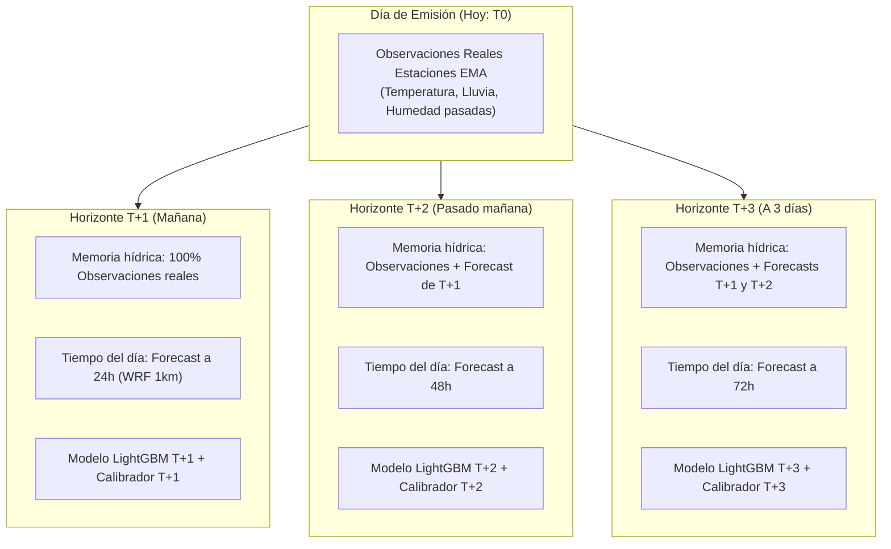
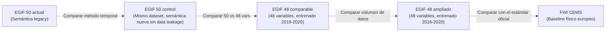

# Guía Explicativa de Modelos, Horizontes y Métricas (EGIF 48 vs. EGIF 50)

> **Destinatarios:** Equipo de desarrollo, colaboradores del proyecto y tribunal del TFM.  
> **Propósito:** Explicar de forma clara, didáctica y rigurosa qué representan las figuras del informe de evaluación temporal, por qué existen modelos independientes para $T+1$, $T+2$ y $T+3$, en qué se diferencian internamente durante su entrenamiento y por qué se comparan las familias de 48 y 50 variables.

---

## 1. Resumen Ejecutivo (Para leer en 2 minutos)

1. **¿Qué evalúan estas figuras?**  
   Muestran el rendimiento de nuestros modelos de Machine Learning (LightGBM) prediciendo el riesgo de ignición de incendios forestales en Galicia sobre un **año ciego completo que nunca vieron al entrenar (2023)**.
2. **El reto del desbalanceo extremo:**  
   Galicia cuenta con 29.574 celdas de $1\text{ km} \times 1\text{ km}$. A lo largo de los 365 días de 2023, esto genera **10.804.365 celdas-día**. De esos casi 11 millones de observaciones, **solo hubo 530 incendios reales** (prevalencia de apenas el $0{,}005\%$). La métrica habitual de *accuracy* no sirve aquí; lo que importa es la **capacidad de ordenación espacial (ranking)** para que los servicios de extinción sepan a qué celdas enviar los medios de vigilancia.
3. **¿Por qué hay 3 modelos ($T+1$, $T+2$, $T+3$)?**  
   Predecir para mañana ($T+1$), pasado mañana ($T+2$) o a 3 días ($T+3$) son problemas predictivos distintos. La incertidumbre del pronóstico meteorológico crece con el tiempo y las memorias de sequedad del suelo se construyen con previsiones encadenadas. No usamos un modelo único "café para todos": entrenamos y calibramos **tres modelos independientes**, cada uno optimizado para su horizonte.
4. **¿Por qué comparar 48 vs. 50 variables?**  
   El modelo original tenía 50 variables. Aplicando el **principio de parsimonia**, eliminamos 2 variables redundantes (`precipitation_sum` del día objetivo y `consecutive_dry_days`), dejando un contrato limpio de 48 variables. Para demostrar científicamente ante el tribunal del TFM que esta reducción no empeora el modelo y que darle más histórico mejora los resultados, comparamos las distintas variantes contra el estándar europeo actual (**FWI CEMS**).
5. **El resultado clave:**  
   El modelo final (**`EGIF 48 ampliado`**, línea azul superior) **supera rotundamente al FWI europeo**. Si los servicios de prevención solo pudieran vigilar el **$1\%$ del territorio gallego más peligroso cada día**, nuestro modelo captura entre el **$10\%$ y el $11\%$ de todos los incendios reales**, mientras que el FWI europeo apenas detectaría el $2{,}8\%$ (multiplicamos por 4 la efectividad de vigilancia).

---

## 2. Diferencias entre los Horizontes $T+1$, $T+2$ y $T+3$

### 2.1. Justificación conceptual y operativa

En la operativa diaria de emergencias contra incendios, la toma de decisiones no es la misma a 24 horas que a 72 horas:
* **$T+1$ (Mañana):** Asignación inmediata de turnos, movimiento táctico de motobombas y patrullas terrestres a concellos específicos.
* **$T+2$ y $T+3$ (A 2 y 3 días):** Planificación estratégica de retenes, posicionamiento preventivo de helicópteros e hidroaviones y coordinación interterritorial.

Si utilizáramos un único modelo genérico para todos los días, estaríamos asumiendo de manera irreal que los datos meteorológicos a 72 horas tienen la misma fiabilidad y la misma estructura que las mediciones a 24 horas.

### 2.2. En qué se diferencian durante el entrenamiento

Durante el entrenamiento en el código (`src/models/canonical_training.py`), los tres modelos se construyen de forma desacoplada con las siguientes diferencias fundamentales:

| Aspecto | $T+1$ | $T+2$ | $T+3$ |
| :--- | :--- | :--- | :--- |
| **Definición de la etiqueta objetivo (*Target*)** | Ignición real en $issue\_date + 1\text{ día}$ | Ignición real en $issue\_date + 2\text{ días}$ | Ignición real en $issue\_date + 3\text{ días}$ |
| **Relación causal aprendida** | Asocia el estado previo con el fuego inmediato (24h) | Asocia el estado previo con el fuego a 48h | Asocia el estado previo con el fuego a 72h |
| **Semilla de submuestreo de negativos** | `seed = 42 + 1 = 43` | `seed = 42 + 2 = 44` | `seed = 42 + 3 = 45` |
| **Población de negativos en entrenamiento** | Muestra determinista propia (ratio 1:100) | Muestra determinista propia (ratio 1:100) | Muestra determinista propia (ratio 1:100) |
| **Importancia de la variable `vpd_mean`** | **Muy alta ($>16\%$)**: La señal a 24h es extremadamente nítida | **Moderada (~$13\%$)**: Mayor dispersión | **Moderada (~$12{,}5\%$)**: Mayor dispersión |
| **Compensación de otras variables** | El modelo confía mucho en la sequedad inmediata del aire | Aumenta el peso de la humedad relativa media y la ventana crítica 12-18h | Mayor peso de ventanas acumuladas de lluvia para compensar ruido |
| **Calibrador de probabilidad (*Platt Scaling*)** | Ajuste sigmoide específico sobre validación 2021 para $T+1$ | Ajuste sigmoide específico sobre validación 2021 para $T+2$ | Ajuste sigmoide específico sobre validación 2021 para $T+3$ |

### 2.3. En qué se diferencian en producción (inferencia con MeteoGalicia)

1. **Para $T+1$:** Todas las memorias retrospectivas de lluvia acumulada (3, 7, 14 y 30 días) se construyen exclusivamente con mediciones físicas reales ya cerradas procedentes de la Red de Estaciones Automáticas (EMA) de MeteoGalicia.
2. **Para $T+2$:** El día de mañana ($T+1$) aún no ha ocurrido. Por tanto, para calcular si en $T+2$ el monte viene seco de los últimos 3 días, el sistema encadena las observaciones pasadas con la predicción del día intermedio ($T+1$).
3. **Para $T+3$:** La memoria reciente debe incorporar dos días simulados por el modelo numérico de predicción meteorológica WRF ($T+1$ y $T+2$).

Al contar con tres modelos especializados, el sistema absorbe naturalmente este incremento de incertidumbre sin descalibrar las alertas.

---

## 3. ¿Por qué comparar 48 vs. 50 Variables?

### 3.1. El principio de parsimonia (Navaja de Ockham)

El prototipo original del sistema utilizaba 50 características (`egif-2d-v1`). Tras un análisis de correlación y de arquitectura, se determinó que dos variables eran problemáticas:
1. `precipitation_sum` (la lluvia puntual acumulada en las 24 horas del propio día objetivo): introducía problemas de sincronización en inferencia según la hora de corte de la predicción y resultaba redundante.
2. `consecutive_dry_days` (contador de días consecutivos sin lluvia): variable escalonada muy sensible a un umbral arbitrario ($1\text{ mm}$) que generaba discontinuidades artificiales.

Ambas se eliminaron en el nuevo contrato operativo de **48 variables** (`egif-2d-48-v1`). Toda la información de sequedad del suelo y del combustible queda capturada de manera más continua y robusta mediante:
* Las ventanas acumuladas de precipitación: `precipitation_sum_3d`, `7d`, `14d` y `30d`.
* El déficit de presión de vapor: `vpd_mean` y `vpd_max_12_18h`.

### 3.2. El diseño experimental del benchmark: Aislando las causas de mejora

Para defender el TFM con rigor científico ante un tribunal, no se puede cambiar todo a la vez (variables, años de datos, código) y afirmar simplemente que el nuevo modelo es mejor. Es obligatorio **aislar cada factor**:

| Modelo en el gráfico | ¿Qué representa? | ¿Para qué sirve en la comparativa? |
| :--- | :--- | :--- |
| **`FWI CEMS`** (Línea morada inferior) | Índice europeo estándar de peligro meteorológico (Copernicus / EFFIS). | **Línea base externa:** Demuestra cuánto valor añade el Machine Learning supervisado sobre los métodos oficiales basados únicamente en física atmosférica. |
| **`EGIF 50 actual`** (Línea gris) | Modelo anterior de 50 variables con la semántica temporal previa. | **Referencia histórica y rollback:** Sirve para certificar que el nuevo desarrollo no introduce regresiones respecto a lo que ya teníamos desplegado. |
| **`EGIF 50 control`** (Línea naranja) | Modelo de 50 variables reentrenado bajo la nueva metodología estricta sin fuga temporal. | **Control metodológico:** Permite saber qué parte del rendimiento se debe a corregir las fechas y qué parte al conjunto de variables. |
| **`EGIF 48 comparable`** (Línea verde) | Modelo limpio de 48 variables entrenado exactamente con los mismos años que el control (2019–2020). | **Aislamiento de variables:** Demuestra que al quitar las 2 variables redundantes el modelo no pierde precisión y se vuelve más parsimonioso y ligero. |
| **`EGIF 48 ampliado`** (Línea azul superior) | Modelo limpio de 48 variables entrenado con un historial ampliado de 5 años (2016–2020). | **Candidato final a producción:** Demuestra que al combinar la arquitectura limpia de 48 variables con mayor volumen histórico, el modelo alcanza su máximo potencial y lidera todas las métricas. |

---

## 4. Guía de Lectura de las Figuras

### 4.1. Figura 1: Rendimiento por horizonte en el test ciego 2023 (4 paneles)

Cada panel mide la capacidad del modelo en un aspecto clave a lo largo de los horizontes $T+1$, $T+2$ y $T+3$:

1. **ROC-AUC (Panel superior derecho):**  
   * *¿Qué mide?* Capacidad global de discriminar celdas con incendio frente a celdas seguras en todo el rango de probabilidades.  
   * *Lectura:* `EGIF 48 ampliado` se mantiene en torno a **$0{,}87$**, un valor sobresaliente. El FWI europeo se queda en $0{,}77$.
2. **Recall en el $1\%$ superior diario (Panel inferior derecho):**  
   * *¿Qué mide?* Si las brigadas de la Xunta de Galicia solo tienen recursos operativos para vigilar o patrullar el **$1\%$ del territorio gallego más crítico cada día** (unas 295 celdas), ¿qué porcentaje de los incendios que ocurran ese día caerán dentro de esa zona priorizada?  
   * *Lectura:* Nuestro modelo captura entre el **$9{,}6\%$ y el $11{,}3\%$ de todas las igniciones del año**. En cambio, el FWI oficial solo capturaría el $2{,}8\%$. **Multiplicamos por cuatro la eficacia de la vigilancia preventiva.**
3. **Recall con FPR = $5\%$ (Panel inferior izquierdo):**  
   * *¿Qué mide?* Si el centro de mando tolera un margen de falsas alarmas del $5\%$ del territorio, ¿cuántos incendios reales detectamos?  
   * *Lectura:* `EGIF 48 ampliado` detecta entre el **$41\%$ y el $44\%$ de todos los fuegos**, frente a menos del $20\%$ detectado por el FWI.
4. **PR-AUC (Panel superior izquierdo):**  
   * *¿Qué mide?* Área bajo la curva Precision-Recall.  
   * *Lectura:* Dado que la probabilidad basal o aleatoria de incendio en Galicia es de apenas $0{,}00005$ ($0{,}005\%$), obtener valores de $0{,}0006$ a $0{,}0007$ significa que el modelo multiplica por **12 a 14 veces la probabilidad de acierto frente al azar**, batiendo ampliamente al FWI ($0{,}00015$).

### 4.2. Figura 2: Importancia interna de variables (Gráfico de barras)

El gráfico muestra la importancia relativa (*Gain* normalizado de LightGBM) de las 12 variables más determinantes del modelo:

1. **`vpd_mean` (Déficit de Presión de Vapor):** Es el factor número uno indiscutible. En física forestal, el VPD representa la "avidez de agua" de la atmósfera: a mayor temperatura y menor humedad, el aire succiona literalmente la humedad del combustible fino muerto (hojarasca y pasto seco), dejándolo listo para arder ante cualquier chispa.
2. **Memorias de precipitación (`precipitation_sum_3d`, `30d`, `14d`, `7d`):** El modelo aprende que no solo importa si llovió hace tres días (humedad superficial), sino también la sequedad acumulada en el último mes (estrés hídrico de la masa vegetal).
3. **`relative_humidity_mean` y `vpd_max_12_18h`:** Condiciones térmicas e higrométricas en la ventana solar crítica de la tarde (12:00 a 18:00 horas), cuando se registran la mayor parte de las igniciones.
4. **`elevation_mean` (Topografía):** La altitud media condiciona el piso bioclimático, las temperaturas medias y la frecuencia de nieblas o humedad litoral.
5. **`road_length_local_km` (Factor Antrópico):** La densidad de carreteras secundarias y pistas rurales en la celda. En Galicia, donde más del $80\%$ de los incendios tienen causa humana (negligencias en quemas agrícolas o intencionalidad), la accesibilidad física del territorio es un predictor clave de susceptibilidad de ignición.

---

## 5. Argumentario Clave para la Defensa del TFM

Cuando el tribunal pregunte por la justificación de estos resultados, los tres pilares de defensa son:

1. **Validación temporal estricta contra Data Leakage:**  
   No se ha utilizado validación cruzada aleatoria tradicional ($K$-Fold), la cual provocaría fuga de datos espaciotemporales. El modelo se ha validado sobre un año cronológico completo e independiente (2023), reproduciendo con exactitud lo que vivirá el sistema en producción.
2. **Utilidad como herramienta de priorización operativa, no como bola de cristal:**  
   Un incendio forestal en Galicia depende de un evento estocástico o antrópico impredecible (una chispa, un descuido, una colilla). Nuestro modelo no pretende predecir el minuto exacto de una ignición, sino **clasificar rigurosamente el territorio por orden de susceptibilidad biofísica y humana** para maximizar el rendimiento del presupuesto limitado de vigilancia.
3. **Superioridad demostrada frente a los estándares vigentes:**  
   Frente al índice europeo FWI que opera a escalas gruesas de 10–25 km y sin calibración regional, nuestro pipeline aporta resolución de $1\text{ km} \times 1\text{ km}$, integra variables locales de orografía y vías de comunicación, y cuadruplica la tasa de detección preventiva bajo presupuestos de vigilancia realistas ($1\%$ superior del territorio).
