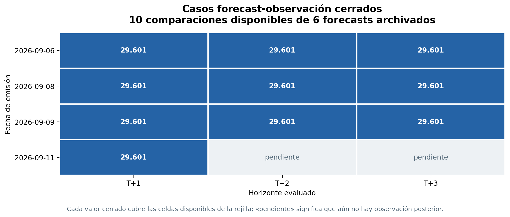
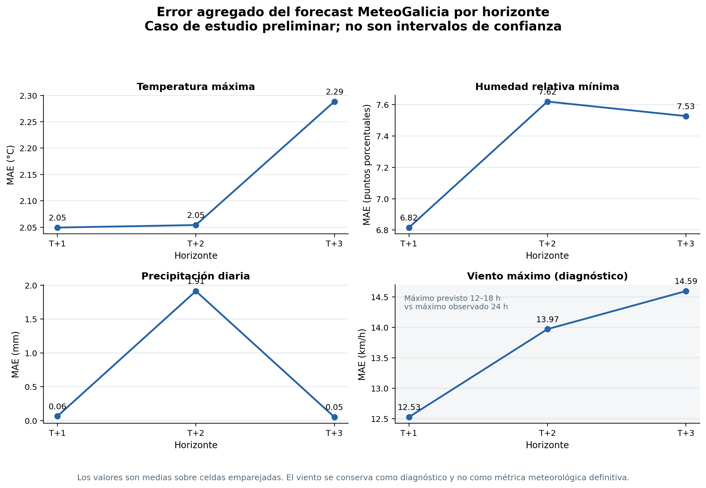

# Evaluación progresiva del forecast MeteoGalicia

## 1. Alcance

Este informe documenta la primera evaluación forecast–observación de la
operación MeteoGalicia WRF 1 km. No evalúa todavía la precisión de las
probabilidades de ignición del modelo EGIF. Su objetivo es comprobar que el
forecast archivado puede emparejarse con observaciones posteriores y medir la
calidad de sus variables meteorológicas.

La instantánea representada corresponde al informe generado en producción el
13/09/2026:

- 6 forecasts WRF 1 km archivados.
- 10 comparaciones cerradas.
- 29.601 celdas por comparación.
- 4 emisiones con al menos un horizonte cerrado.
- Observaciones disponibles hasta el 12/09/2026.
- Sin utilizar filas `forecast_proxy`.

La instantánea reproducible se conserva en
`docs/technical/meteogalicia_case_study_20260913.json`. En producción, la
fuente viva es `data/processed/evaluation/meteogalicia/meteogalicia_forecast_metrics.json`.

El snapshot versionado contiene métricas agregadas y no conserva los valores de
las 29.601 celdas de cada comparación. Por tanto, la figura de comparación
directa se genera a partir del Parquet de pares producido por el evaluador en
la siguiente ejecución de producción.

## 2. Estado de las comparaciones



**Figura 1.** Cada fila representa una fecha de emisión y cada columna un
horizonte. Un valor indica que la observación posterior ya estaba disponible y
que se compararon las celdas de la rejilla. `Pendiente` significa que el
forecast se archivó, pero todavía no existía una observación posterior para
cerrar ese horizonte.

La figura muestra la naturaleza progresiva de la evaluación: una emisión puede
tener T+1 cerrado mientras T+2 y T+3 permanecen pendientes. No se rellenan
fechas futuras con observaciones inventadas ni se reutilizan como si fueran
mediciones reales.

## 3. Comparación directa del caso práctico

Esta es la figura que compara realmente los datos: cada punto representa una
celda de la rejilla para una emisión y un horizonte concretos. El eje X es la
variable pronosticada por WRF y el eje Y es la observación posterior. La línea
discontinua representa el acuerdo perfecto; cuanto más cerca estén los puntos
de ella, menor es el error de esa celda.


El script selecciona por defecto la última combinación emisión–horizonte que ya
tiene observación cerrada. También se puede fijar un caso concreto, por
ejemplo:

```bash
MPLCONFIGDIR=/tmp/fire-risk-mpl \
PYTHONPATH=/srv/fire-risk \
/opt/miniconda3/envs/incendios-forestales/bin/python \
scripts/plot_meteogalicia_evaluation.py \
  --input /srv/fire-risk/data/processed/evaluation/meteogalicia/meteogalicia_forecast_metrics.json \
  --pairs /srv/fire-risk/data/processed/evaluation/meteogalicia/meteogalicia_forecast_observation_pairs.parquet \
  --issue-date 2026-09-11 \
  --horizon 1 \
  --output-dir /srv/fire-risk/data/processed/evaluation/meteogalicia
```

La figura no debe interpretarse como una comparación de probabilidades de
incendio: es una validación de las entradas meteorológicas. La evaluación de
las probabilidades EGIF requiere conservar también las predicciones operativas
y esperar a que existan las etiquetas de ignición posteriores.

## 4. Errores meteorológicos agregados



**Figura 2.** MAE agregado sobre las celdas emparejadas, separado por variable
y horizonte. Los puntos T+1, T+2 y T+3 son valores agregados, no intervalos de
confianza. El panel del viento se presenta como diagnóstico porque todavía no
existe una correspondencia exacta entre la estadística prevista y la observada.

| Horizonte | Emisiones cerradas | Temperatura MAE | Humedad MAE | Precipitación MAE |
|---|---:|---:|---:|---:|
| T+1 | 4 | 2,05 °C | 6,82 puntos porcentuales | 0,063 mm |
| T+2 | 3 | 2,05 °C | 7,62 puntos porcentuales | 1,913 mm |
| T+3 | 3 | 2,29 °C | 7,53 puntos porcentuales | 0,051 mm |

El acierto de lluvia/no lluvia con umbral de 1 mm fue 98,24 %, 99,17 % y
98,82 % para T+1, T+2 y T+3, respectivamente. Esta métrica debe interpretarse
con cuidado porque la mayoría de las celdas no registran lluvia; por eso se
conservan también MAE, RMSE y sesgo.

## 5. Interpretación del viento

El forecast de MeteoSIX entrega `moduleValue` en km/h. La agregación operativa
calcula el máximo entre las 12:00 y las 18:00 hora local. En cambio, el estado
observado actual contiene `VV_MAX_10m` como máximo diario y lo asigna a
`vmax_vc` y a `wind_speed_max_12_18h`.

Por tanto, el sesgo negativo de aproximadamente 12–14 km/h observado en el
primer informe no debe presentarse como error definitivo de WRF. Se está
comparando un máximo previsto de seis horas con un máximo observado de
24 horas. Una comprobación adicional mostró que la comparación preliminar con
la velocidad media es mucho más próxima:

| Comparación, forecast del 11/09 frente a observación del 12/09 | MAE | Sesgo |
|---|---:|---:|
| Media prevista 12–18 h vs media observada diaria | 3,58 km/h | +2,09 km/h |
| Máximo previsto 12–18 h vs máximo observado diario | 13,31 km/h | −13,29 km/h |

La comparación definitiva requerirá observaciones horarias para calcular el
máximo observado real entre las 12:00 y las 18:00. Hasta entonces, el viento
queda excluido de las conclusiones principales sobre precisión meteorológica.

## 6. Qué queda demostrado

La integración operativa está validada técnicamente: el sistema descarga y
archiva WRF 1 km, conserva la emisión y las fechas válidas, cubre la rejilla de
29.601 celdas y puede cerrar comparaciones con observaciones posteriores.

Las primeras comparaciones forecast–observación pueden presentarse como casos
de estudio. No obstante, diez casos no permiten generalizar el rendimiento a
toda la temporada ni estimar intervalos de confianza robustos.

La validación estadística completa del rendimiento del riesgo queda condicionada
a acumular forecasts, predicciones operativas y etiquetas EGIF reales
posteriores. Esa fase deberá medir PR-AUC, Brier score, fiabilidad, recall con
presupuestos del 1 %, 5 % y 10 %, y degradación entre T+1, T+2 y T+3.

## 7. Reproducibilidad

Evaluación meteorológica en producción:

```bash
sudo -u fire-risk bash -lc '
set -Eeuo pipefail
cd /srv/fire-risk/app
PYTHONPATH=/srv/fire-risk/app \
/opt/miniconda3/envs/incendios-forestales/bin/python \
scripts/evaluate_meteogalicia_forecasts.py \
  --forecast-dir /srv/fire-risk/data/raw/meteogalicia \
  --state /srv/fire-risk/data/processed/state/weather_daily_state.parquet \
  --output-dir /srv/fire-risk/data/processed/evaluation/meteogalicia
'
```

Además de los dos ficheros de métricas, esta ejecución crea
`meteogalicia_forecast_observation_pairs.parquet`. Ese fichero contiene una
fila por celda comparada y las columnas `*_forecast` y `*_observed` de cada
variable; es el origen de la figura directa y debe conservarse fuera de Git.

Generación de figuras a partir del informe:

```bash
MPLCONFIGDIR=/tmp/fire-risk-mpl \
PYTHONPATH=. python scripts/plot_meteogalicia_evaluation.py \
  --input data/processed/evaluation/meteogalicia/meteogalicia_forecast_metrics.json \
  --output-dir docs/technical
```

En el servidor, para generar la figura junto al informe de evaluación:

```bash
MPLCONFIGDIR=/tmp/fire-risk-mpl \
PYTHONPATH=/srv/fire-risk \
/opt/miniconda3/envs/incendios-forestales/bin/python \
scripts/plot_meteogalicia_evaluation.py \
  --input /srv/fire-risk/data/processed/evaluation/meteogalicia/meteogalicia_forecast_metrics.json \
  --pairs /srv/fire-risk/data/processed/evaluation/meteogalicia/meteogalicia_forecast_observation_pairs.parquet \
  --output-dir /srv/fire-risk/data/processed/evaluation/meteogalicia
```

La imagen resultante se llama
`meteogalicia_case_direct_comparison.png`. Para incorporarla a la memoria,
debe copiarse posteriormente a `docs/technical/` junto con el JSON o
regenerarse localmente a partir de ambos ficheros.

Para regenerar las figuras de esta instantánea:

```bash
MPLCONFIGDIR=/tmp/fire-risk-mpl \
PYTHONPATH=. python scripts/plot_meteogalicia_evaluation.py \
  --input docs/technical/meteogalicia_case_study_20260913.json \
  --output-dir docs/technical
```
