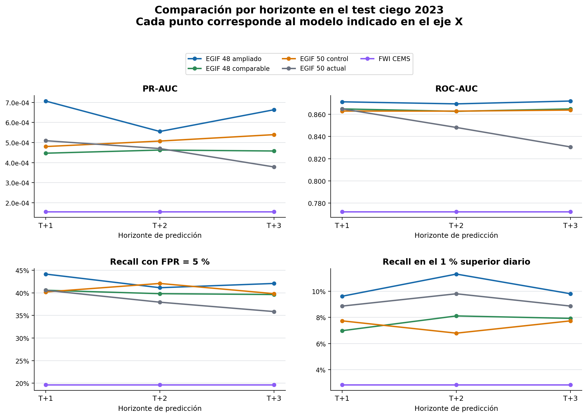
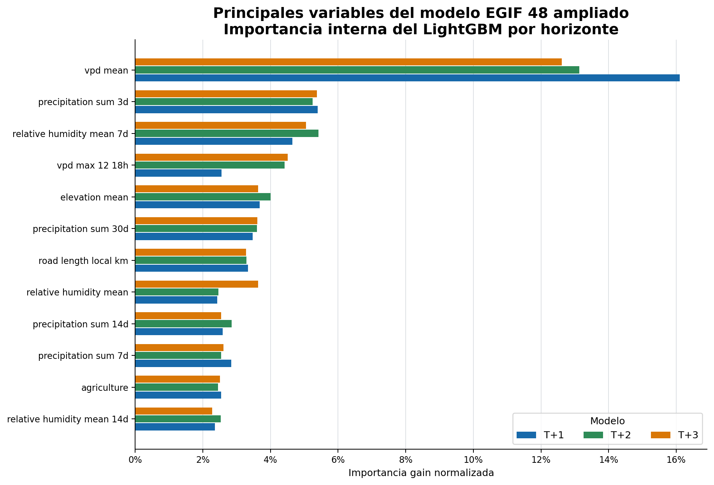

# Informe de figuras y resultados del modelo EGIF

## 1. Objetivo

Este documento reúne las figuras que deben acompañar la explicación de los
resultados del modelo EGIF 48. Su objetivo es que una persona que no haya
leído el código pueda entender qué se está comparando, cómo se lee cada
gráfico y qué conclusiones son válidas.

Las figuras se han generado con el resultado de la evaluación temporal sobre
el año 2023. La evaluación contiene 10.804.365 filas y 530 igniciones
positivas, por lo que se trata de un problema muy desbalanceado. Por ese
motivo no se utiliza únicamente accuracy: se muestran PR-AUC, ROC-AUC,
recall con FPR del 5 %, y recall dentro del 1 % de celdas prioritarias.

## 2. Qué modelos aparecen

| Familia | Interpretación |
|---|---|
| EGIF 48 ampliado | Modelo operativo EGIF 48 entrenado con 2016-2020. Es el candidato principal. |
| EGIF 48 comparable | Mismo contrato, entrenado con 2019-2020. Sirve para una comparación controlada. |
| EGIF 50 control alineado | Control con 50 variables y la misma semántica temporal que el EGIF 48. |
| EGIF 50 actual | Modelo anterior, conservado como referencia, rollback y shadow model. |
| FWI CEMS | Baseline físico externo. No es un modelo EGIF ni se entrena con las mismas variables. |

Los tres horizontes son independientes:

- `T+1`: riesgo del día siguiente.
- `T+2`: riesgo dentro de dos días.
- `T+3`: riesgo dentro de tres días.

## 3. Figura 1 - rendimiento por horizonte



### Cómo se lee

La figura contiene cuatro paneles, uno por métrica. El eje horizontal siempre
representa el horizonte: `T+1`, `T+2` y `T+3`. Cada línea de color representa
una familia de modelos y cada punto es un resultado concreto de esa familia
en un horizonte concreto.

La línea no representa una distribución ni un intervalo de confianza. Solo
conecta los tres valores para hacer visible si el rendimiento cambia al
alejarse el horizonte. Por ello, el gráfico de puntos conectados es más
adecuado que un boxplot: cada familia tiene únicamente tres observaciones.

### Lectura de los resultados

El EGIF 48 ampliado obtiene:

| Horizonte | PR-AUC | ROC-AUC | Recall con FPR 5 % | Recall en el 1 % superior |
|---|---:|---:|---:|---:|
| T+1 | 0,000707 | 0,8713 | 44,15 % | 9,62 % |
| T+2 | 0,000555 | 0,8695 | 41,13 % | 11,32 % |
| T+3 | 0,000664 | 0,8720 | 42,08 % | 9,81 % |

El FWI obtiene aproximadamente PR-AUC 0,000154, ROC-AUC 0,7720, recall del
19,62 % con FPR del 5 % y recall del 2,83 % en el 1 % superior diario.

La lectura correcta es que el EGIF 48 ordena mejor las celdas que el FWI en
este test retrospectivo. No significa que las probabilidades sean perfectas
ni que el modelo pueda predecir exactamente la localización de cada incendio.
El resultado debe interpretarse como una mejora del ranking para priorizar
recursos.

### Qué no demuestra esta figura

- No demuestra todavía el rendimiento de un forecast real de MeteoGalicia.
- No representa incertidumbre estadística.
- No prueba causalidad entre una variable y una ignición.
- No permite afirmar que T+3 sea siempre peor que T+1: los valores observados
  dependen también de la muestra y de la dificultad de cada año.

## 4. Figura 2 - importancia interna de las variables



### Cómo se lee

La figura muestra las doce variables con mayor importancia media en los tres
modelos EGIF 48 ampliados. Cada color corresponde a un horizonte. La métrica
representada es `gain` de LightGBM, normalizada dentro de cada horizonte.

`gain` indica cuánto contribuye una variable a reducir la función de pérdida
en los splits de los árboles. Por tanto, la figura explica el funcionamiento
interno del modelo, pero no es una prueba de causalidad.

En este entrenamiento destacan `vpd_mean`, las memorias de precipitación de
3 y 30 días, variables de humedad relativa, elevación y longitud de carreteras
locales. La interpretación física es coherente con el problema: el déficit de
presión de vapor aproxima la sequedad atmosférica, la precipitación resume la
disponibilidad de humedad y el relieve y la accesibilidad aportan contexto
territorial.

Las variables correlacionadas pueden repartirse la importancia o concentrarla
de forma arbitraria. En una versión científica final se debe complementar
esta figura con importancia por permutación, SHAP y ablaciones por grupos de
variables.

## 5. Figuras adicionales recomendadas para el TFM

La evaluación del forecast meteorológico se documenta de forma independiente
en el [informe de evaluación MeteoGalicia](informe_evaluacion_meteogalicia.md).
Incluye la matriz de emisiones cerradas, la comparación directa por celda y
los errores por horizonte, con la advertencia metodológica específica para el
viento. La comparación directa es la figura adecuada para enseñar el caso
práctico forecast–observación: el forecast aparece en el eje X, la medición
real en el eje Y y la línea 1:1 representa la predicción perfecta.

### 5.1 Recall frente al presupuesto espacial

Es la figura más importante desde el punto de vista operativo. Debe mostrar
cuántas igniciones se cubren cuando solo se pueden vigilar o priorizar el 1 %,
5 % o 10 % de las celdas. Se compararán EGIF 48 ampliado, control EGIF 50 y
FWI.

Esta figura traduce el resultado estadístico a una decisión real de
movilización de medios. Todavía no se incluye porque la evaluación actual
guarda el punto del 1 % y la FPR del 5 %, pero no todos los presupuestos
espaciales con sus intervalos de confianza.

### 5.2 Diagrama de fiabilidad

Debe comparar la probabilidad predicha con la frecuencia observada por bandas
de probabilidad, separando T+1, T+2 y T+3. Es necesario generarlo cuando
exista un histórico suficiente de pares forecast-observación de MeteoGalicia.

La evaluación actual utiliza ERA5 como `era5_perfect_benchmark`: es válida
para comparar modelos retrospectivamente, pero no demuestra que las
probabilidades estén calibradas frente a un forecast meteorológico real.

### 5.3 Mapa espacial de un día de test

Debe mostrar lado a lado el riesgo predicho y las igniciones observadas para
una fecha concreta de 2023. La leyenda, la rejilla y la escala deben ser
idénticas en ambos paneles. Es la figura más fácil de entender para un perfil
no técnico, pero no debe sustituir a las métricas agregadas.

### 5.4 Diagrama del pipeline

El informe técnico contiene el flujo completo desde la descarga meteorológica
hasta la publicación del mapa. Conviene incluirlo en la memoria porque
explica la separación entre datos históricos, forecast, features, modelos y
dashboard.

## 6. Limitaciones y mensaje para la defensa

El resultado actual es una evaluación de ranking sobre un test temporal y
completo, no una validación operacional final. El modelo EGIF 48 ampliado es
el candidato para producción, pero su promoción científica definitiva sigue
condicionada a validar las capas estáticas, archivar forecasts MeteoGalicia y
medir la degradación real de T+1 a T+3.

La conclusión defendible es:

> En el test retrospectivo 2023, el modelo EGIF 48 ampliado separa mejor las
> celdas con ignición que el FWI CEMS y que los controles EGIF 50 evaluados.
> Su utilidad operativa debe expresarse como priorización espacial bajo un
> presupuesto de vigilancia, no como una certeza de incendio.

## 7. Reproducibilidad

Regenerar el perfil por horizonte:

```bash
MPLCONFIGDIR=/tmp/fire-risk-mpl \
/opt/anaconda3/envs/incendios-forestales/bin/python \
scripts/plot_model_family_horizons.py
```

Regenerar la importancia de variables:

```bash
python scripts/plot_egif48_feature_importance.py
```

Generar el PDF ilustrado:

```bash
python scripts/build_figure_report_pdf.py
```

El resultado queda en `output/pdf/informe_graficos_resultados.pdf`.

Las figuras se construyen a partir de:

```text
data/models/evaluation/model_family_comparison.json
data/models/experiments/expanded/forecast_risk_egif_48_t1.joblib
data/models/experiments/expanded/forecast_risk_egif_48_t2.joblib
data/models/experiments/expanded/forecast_risk_egif_48_t3.joblib
```

No se añade una fuente visual dentro de la figura para evitar sobrecargarla.
La procedencia, el conjunto de test y las limitaciones quedan documentados en
este informe y en `docs/explanations/informe_cambios_resultados_despliegue_v0_4.md`.
